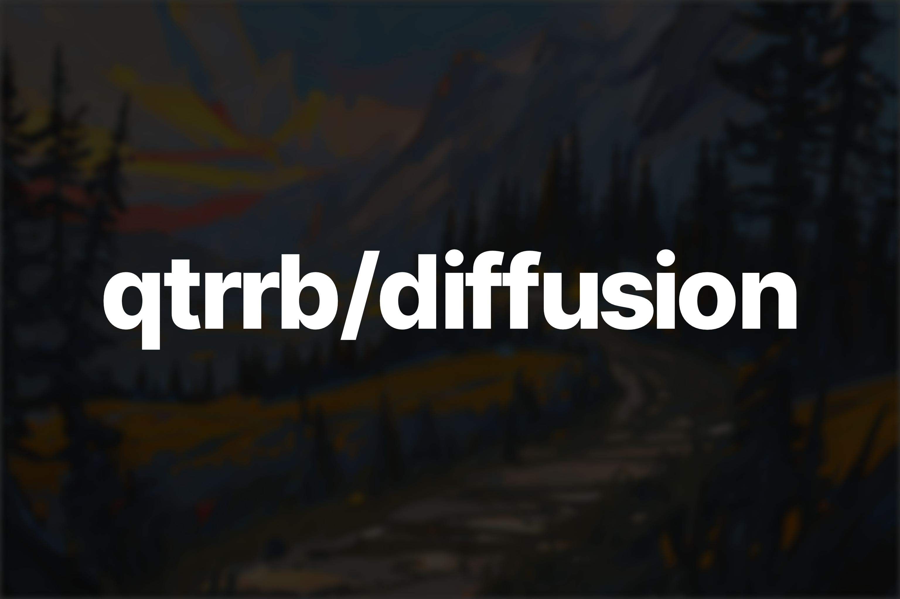

# qtrrb/diffusion

A fork of [stable diffusion](https://github.com/Stability-AI/stablediffusion) that adds optimizations, features and an API



> **Warning** This project won't be updated for an indefinite amount of time.

## Main Features

- Upscaling
- A1111 LoRA support
- Textual inversion support
- ControlNet
- Unlimited tokens
- VAE loading
- K-Diffusion schedulers
- Safetensors support
- Optimizations (fp16, Attention slicing)
- Text to Image API
- Image to Image API

## Usage

- Clone this repository

```bash
git clone https://github.com/qtrrb/diffusion
```

- Initialize a new virtual environment

```bash
python -m venv .env
```

- Activate the virtual environment

- Install necessary dependencies

```bash
pip install -r requirements.txt
```

- Run the API with

```bash
python -m diffusion
```
