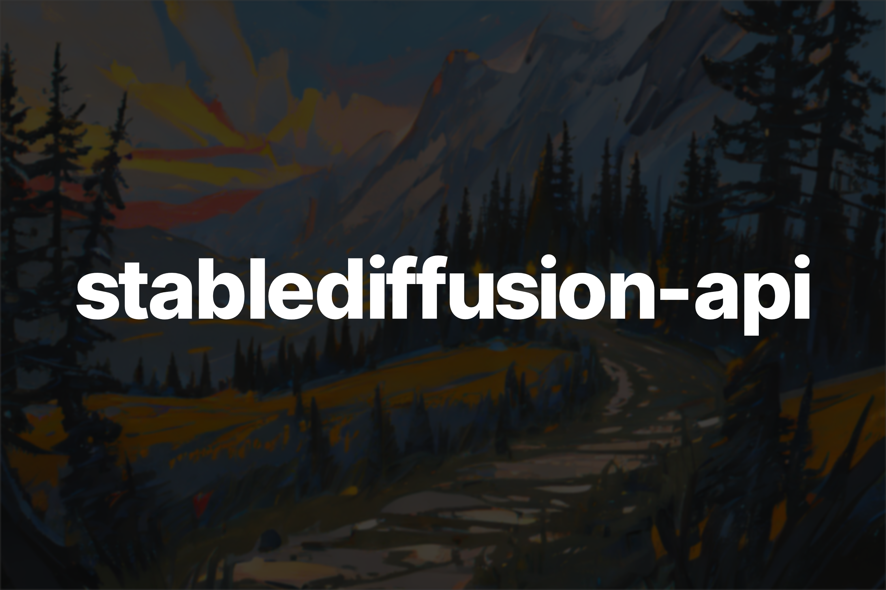

# stablediffusion-api

A fork of [stable diffusion](https://github.com/Stability-AI/stablediffusion) that adds an API and optimizations/features



## Roadmap

> **Warning**
>
> This project is heavily experimental and is subject to changes.

- [ ] Upscaling
- [ ] Code refactoring
- [ ] ...
- [x] ~~LoRA support~~
- [x] ~~Image to Image API~~
- [x] ~~VAE loading~~
- [x] ~~Safetensors Support~~
- [x] ~~Default FP16 Models~~
- [x] ~~Text to Image API~~

## Usage

- Clone this repository

```bash
git clone https://github.com/qtrrb/stablediffusion-api
```

- Install necessary dependencies

```bash
conda env create -f environment.yaml
conda activate ldm
```

- Run the project with

```bash
python main.py
```
or

```bash
uvicorn main:app --reload
```
